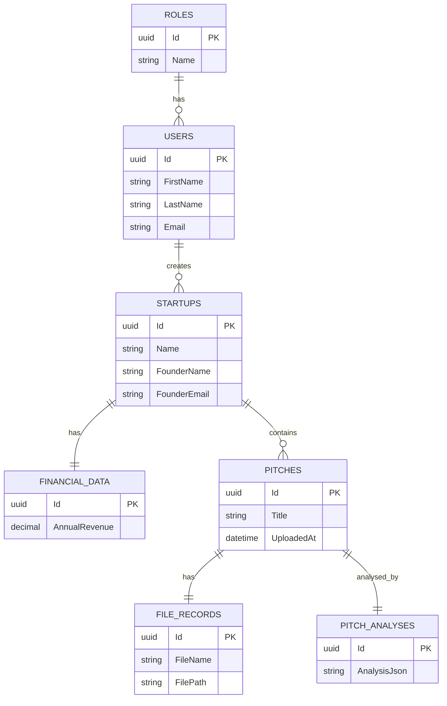

# ER Diagram

The following Mermaid diagram represents the main entities and relationships for the application.

Explanation: A `User` (founder or admin) can create `Startup` records. Each `Startup` may have optional `FinancialData`, multiple `Pitches`, each `Pitch` has an uploaded `FileRecord` and an associated `PitchAnalysis` produced by the AI service.
